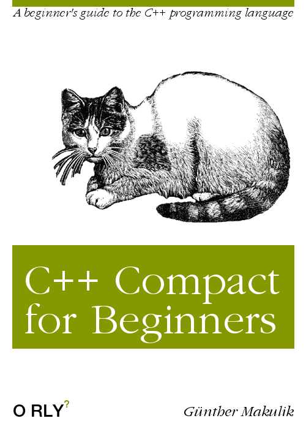

# C++ Compact for Beginners

## Disclaimer:  
~ _Not as serious as the "Hitchhiker's Guide to Universe", but probably equally well misleading!_ ~

To contribute sent pull requests [here](https://github.com/makulik/C-PlusPlus-Compact-for-Beginners).

[**Enter**](./TOC)

